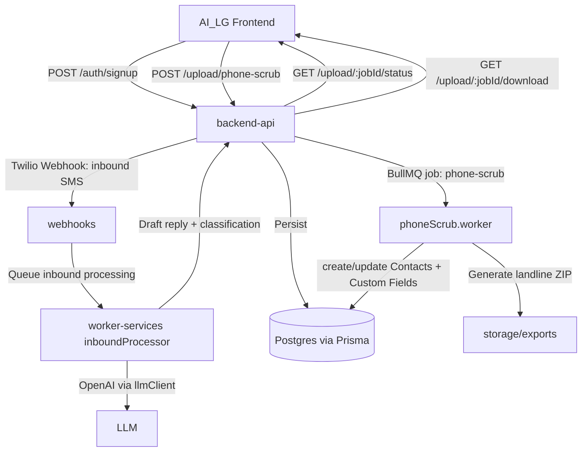

# AI Lead Genie — Automation Map (End-to-End)

This is the current end-to-end flow of the system as implemented in this repo, from signup through upload, messaging, and AI automation.

## System Map (High level)

## Signup → Organization Provisioning

**Frontend**
- Signup page: AI_LG/src/pages/SignUp.tsx
- Session storage: AI_LG/src/lib/session.ts (localStorage)

**Backend**
- Route: backend-api/src/routes/auth.js (`POST /auth/signup`)
- Creates Organization/User/Brand/Wallet/Subscription.
- Best-effort Twilio provisioning (subaccount + trial number) occurs here.

**Resulting DB objects** (Prisma)
- Organization, User, Brand, OrganizationWallet, Subscription

## Upload → Header Mapping → Phone Scrub → Import

**Frontend**
- Upload page: AI_LG/src/pages/UploadList.tsx
- Sends file to `POST /upload/phone-scrub` and polls `GET /upload/:jobId/status`.
- Downloads landline ZIP from `GET /upload/:jobId/download` when complete.

**Backend**
- Controller: my-saas-platform/apps/backend-api/src/controllers/upload.controller.ts
  - Creates UploadJob
  - Queues BullMQ job `phone-scrub`
  - Accepts optional `mapping` (JSON) and `brandId` as multipart fields

**Worker**
- Worker logic: my-saas-platform/apps/backend-api/src/workers/phoneScrub.worker.ts
  - Parses file (`parseUploadFile`)
  - Normalizes + validates phones
  - Inserts mobile contacts into DB
  - Stores unmapped CSV columns into `ContactCustomField` (per brand)
  - Exports landlines ZIP into `storage/exports` (or EXPORT_STORAGE_PATH)

**Custom fields behavior**
- Any CSV column not mapped to a supported Contact field becomes a custom field.
- Stored as:
  - CustomFieldDefinition (brand-scoped)
  - ContactCustomField (per contact)

## Messenger Contact Sidebar (Manual Edits)

Goal: let users edit freely in UI, while server guarantees canonical formats.

**Backend**
- Contact update endpoint: my-saas-platform/apps/backend-api/src/routes/contacts.js
  - Normalizes phone to E.164; rejects invalid phone with HTTP 400
  - Normalizes addresses (light normalization)
  - Supports auth via Bearer JWT (preferred) OR `x-organization-id` fallback

**Custom fields endpoints**
- List brand definitions: `GET /contacts/custom-fields/definitions?brandId=...`
- Read contact custom fields: `GET /contacts/:id/custom-fields`
- Upsert contact custom fields: `PUT /contacts/:id/custom-fields` with body `{ fields: { [name]: value } }`

## Inbound SMS → AI Classification → Draft Reply

**Backend ingress**
- Twilio webhook: my-saas-platform/apps/backend-api/src/routes/webhooks.js
  - Normalizes From/To phone numbers before persistence

**AI processing**
- Worker: my-saas-platform/apps/worker-services/inboundProcessor.ts
  - Classifies inbound message
  - Drafts reply with guardrails
  - (Future) triggers warm-calling workflow from SMS replies

**LLM client**
- my-saas-platform/apps/llmClient.ts

## Where the “Parked 10DLC Info” Lives (Current)

- The Business Info / 10DLC draft is stored locally in the frontend (localStorage) until the user upgrades to a paid plan.
- Page: AI_LG/src/pages/BusinessInfo.tsx

## Notes / Known Next Steps

- Cold calling campaigns: design calls for a separate table/flow; not implemented in this doc.
- Warm-calling automation: worker has TODO hooks; Twilio Voice orchestration still pending.
- If you want upload mapping to be *persisted per UploadJob*, that requires a Prisma schema change to store mapping JSON on UploadJob.
